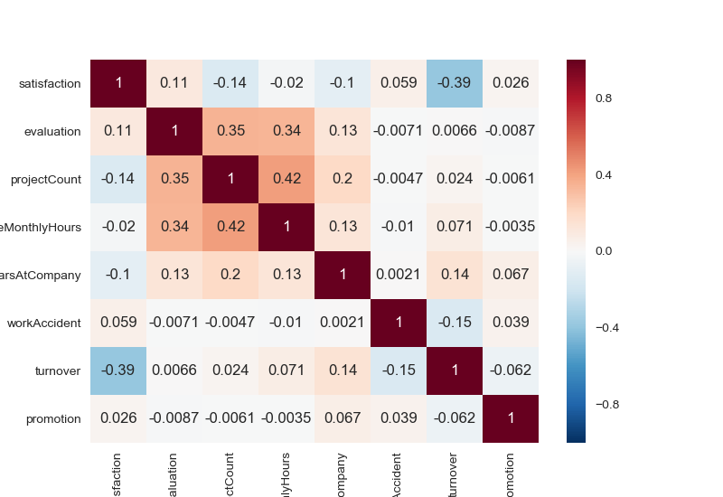
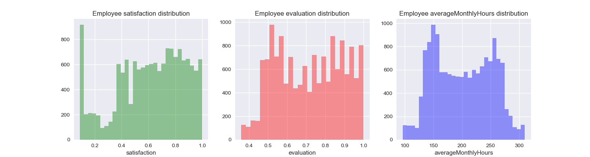
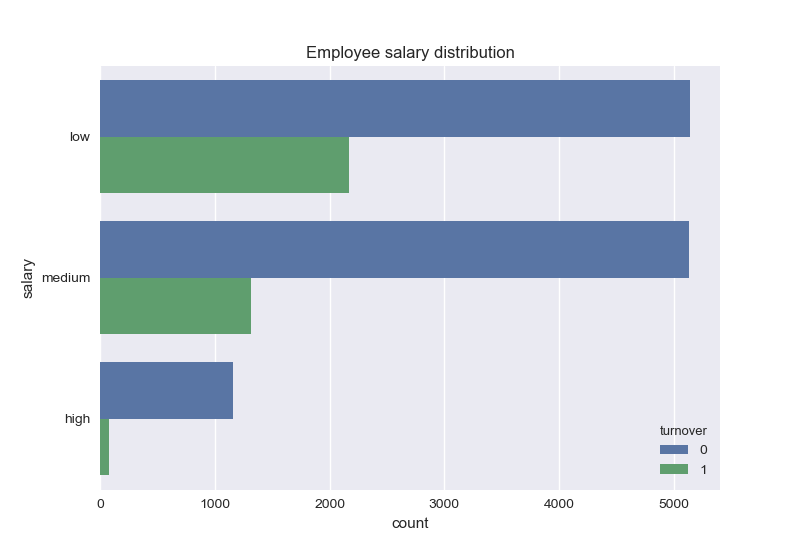
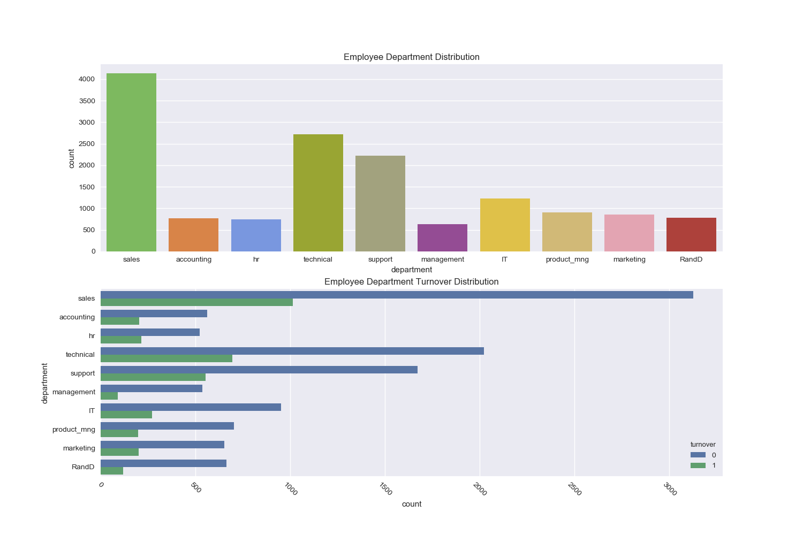
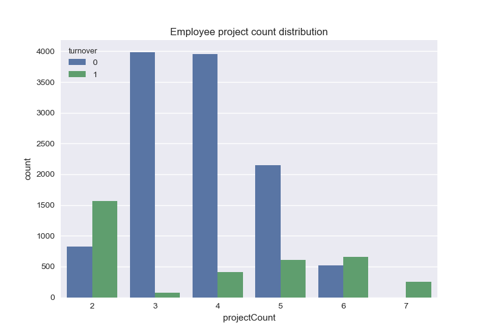
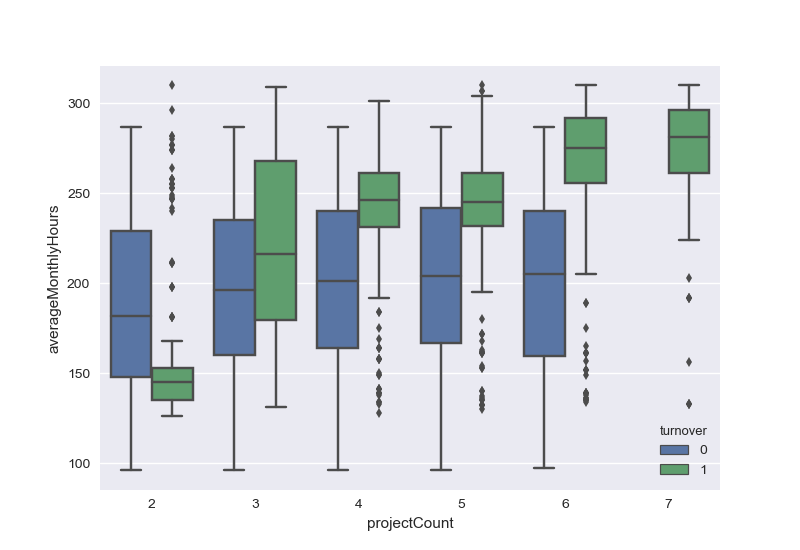
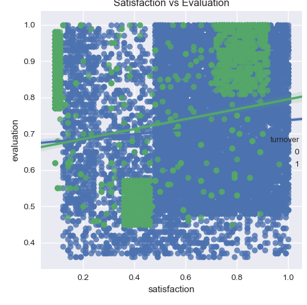
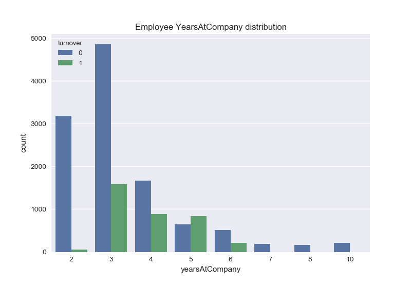
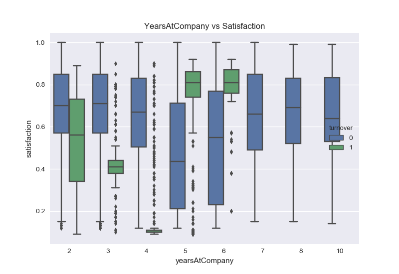

# EmployeeTurnoverPrediction
This is my notebook for trying to predict the Employee Turnover Rate. 

## Data Exploration
I first began by exploring the correlation between all the variables.

### Correlation
Correlation: 

What I found was that there was a strong correlation with the satisfaction, evaluation, and projectCount.

### Satisfaction, Evaluation, AverageMonthlyHours

**Notes**
* Large spike in the employee satisfaction distribution, grouped at low satisfaction. Multimodal for more positive satisfaction
* Employee evaluation is also multimodal. Data range only covers half of the evaluation range. 
* AverageMonthlyHours is  bimodal. First one around 150 hours and second at 250 hours, which are within 1 std dev of the average. 
* Shows that employees that left were either underworked or overworked

### Salary

### Department

### ProjectCount Distribution

### Eval, satisfaction, averageMonthlyHours KDE

Evaluation
* Bimodal distribution for employees that turnover. Low or high performance -> employees tend to leave
* Employees will stay between 0.6 to 0.8

Satisfaction
* Three peaks at 0.1, 0.4, and 0.85 for people that leave the company. Categorized to really low, low, and high for people who leave.
* In between those ranges are people who stayed. 

AverageMonthlyHours
* AverageMonthlyHours is  bimodal. First one around 150 hours and second at 250 hours, which are within 1 std dev of the average. 
* Shows that employees that left were either underworked or overworked

### ProjectCount vs AverageMonthlyHours

* Correlation betweeen hours worked and number of projects as it increases, for people who leave.
* More obvious for people, who had a lot of project and worked a lot of hours
* People, who didn't turn over stayed right around the monthly hours average

### Satisfaction vs Evaluation 

* Two main distributions of satisfaction grouped with high evaluation from 0.75 to nearly 1.0. Both on the high and low end
  * Recall that the average is 0.71 so big correlation with high evaluation and satisfaction that leads to turnovers. People who are praised highly, but are both unhappy and happy about their work
* In the other cluster, we have low evaluation and low satisfaction. This could be a group of people, who underperformed.
#### Thinking about it
Why do people with great performance, but are happy, end up leaving the job? My guess is that they found a better paying job. It might be worth to crosscheck this with their salary or yearsAtCompany.

### YearsAtCompany

* 3-5 years seem to be the general range for people to leave the company. 3 seems to be the average
* Employees with 5 years should be monitored for their reasons of leaving the company.

### YearsAtCompany vs Satisfaction

* Comparing with the satisfaction due to its high correlation, we find that the people leaving within 3 years are highly unsatisfied. 
* On the other hand, the 4-5 years, these people are happy, but leaving. This is questionable.

## Machine Learning Work
I will plan on training the following models to make my predictions. My plan is to do it in TensorFlow
1. Logistic Regression
2. Random Forest Classifier
3. Gradient Boosting
4. Neural Networks

Columns
satisfaction - continuous
evaluation - continuous
projectCount - continouous
averageMonthlyHours - continuous
yearsAtCompany - continouous
workAccident - categorical
turnover - categorical
promotion - categorical
department - categorical
salary - categorical

### Logistic Regression
Linear regression under the hood, which works by outputting probabilities by a sigmoid function. As opposed to linear regression,
we take the minimum of the Log Loss to yield the maximum likelihood estimate. They do this, because they need to penalize misclassifications
when there is a differentiation in the output probability. (0.9 vs 0.9999)

Things to try with current results:
* L2 regularization (recall that this avoid the loss being driven to 0 in high dimensions)
* Compute a confusion matrix, precision, recall, and F1 score [DONE]
* Establish Logistic Regression as the base model
* Set up a validation and test set
* Set up feature crossing
* Set up way to compute model complexity

